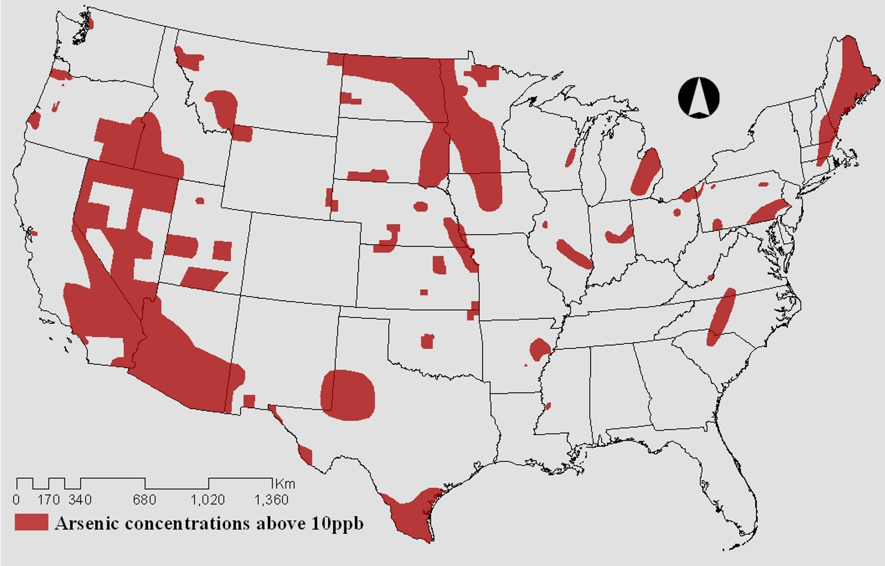

\newpage
\abstract

While the Safe Drinking Water Act seeks to establish standards for many drinking water contaminants, many water systems still experience elevated concentrations of contaminants. This analysis compares arsenic concentrations in southeastern and northeastern states, explores whether the occurrence of other water contaminants and choosen socioeconomic factors predict arsenic concentrations in North Carolina and Massachusetts, and examines whether socioeconomic factors explain variation in PFAS concentrations in the United States. Results indicate that North Carolina and South Carolina experience elevated arsenic concentrations compared to other southeastern states, as do Massachusetts and Maine as compared to other northeastern states. Arsenic concentrations are significantly predicted by trihaloomethane concentrationos and by size of the population served by a Community Water System (CWS) in North Carolina but not in Massachusetts. Finally, socioeconomic variables examined do not siginficanntly explain variation inn PFAS concentrations.

\newpage
\tableofcontents 
\newpage
\listoftables 
\newpage
\listoffigures 
\newpage

```{r setup, include=FALSE, warning=FALSE, message=FALSE}
# Set your working directory
setwd("/Users/rachelgonsenhauser/Documents/Final_Project_Environmental_Data_Analytics/Code")
getwd()

# Load your packages
library(dplyr)
library(tidyverse)
library(lubridate)
library(ggplot2)
#install.packages("nlme")
#install.packages("piecewiseSEM")
library(nlme) 
library(agricolae)
library(piecewiseSEM)
#install.packages("viridis")
#install.packages("RColorBrewer")
#install.packages("colormap")
library(viridis)
library(RColorBrewer)
library(colormap)
library(cowplot)

# Set your ggplot theme
mytheme <- theme_classic(base_size = 14) +
 theme(axis.text = element_text(color = "black"), 
        legend.position = "right")
theme_set(mytheme)

# Load your datasets
Water.Quality.And.Income.Processed <- read.csv("../Data/Processed/CDC_WaterQualityAndincome_Processed.csv")

# Changing data to appropriate classes for analysis

## Numeric variables
Water.Quality.And.Income.Processed$Arsenic_ugL <- as.numeric(Water.Quality.And.Income.Processed$Arsenic_ugL)
Water.Quality.And.Income.Processed$PFAS_ppt <- as.numeric(Water.Quality.And.Income.Processed$PFAS_ppt)
Water.Quality.And.Income.Processed$TTHM_ugL <- as.numeric(Water.Quality.And.Income.Processed$TTHM_ugL)
Water.Quality.And.Income.Processed$Uranium_ugL <- as.numeric(Water.Quality.And.Income.Processed$Uranium_ugL)
class(Water.Quality.And.Income.Processed$Population.Served) <- as.numeric(Water.Quality.And.Income.Processed$Population.Served)

Water.Quality.And.Income.Processed$MHI <-
  str_replace(Water.Quality.And.Income.Processed$MHI,
              pattern = "([,])", replacement = "")
class(Water.Quality.And.Income.Processed$MHI)
Water.Quality.And.Income.Processed$MHI <- as.numeric(Water.Quality.And.Income.Processed$MHI)

## Factor variables 
Water.Quality.And.Income.Processed$countyFIPS <- as.factor(Water.Quality.And.Income.Processed$countyFIPS)
Water.Quality.And.Income.Processed$stateFIPS <- as.factor(Water.Quality.And.Income.Processed$stateFIPS)
Water.Quality.And.Income.Processed$CWS.Name <- as.factor(Water.Quality.And.Income.Processed$CWS.Name)
Water.Quality.And.Income.Processed$PWS.ID <- as.factor(Water.Quality.And.Income.Processed$PWS.ID)
Water.Quality.And.Income.Processed$MCL_Arsenic <- as.factor(Water.Quality.And.Income.Processed$MCL_Arsenic)
Water.Quality.And.Income.Processed$MCL_Uranium <- as.factor(Water.Quality.And.Income.Processed$MCL_Uranium)
Water.Quality.And.Income.Processed$MCL_TTHM <- as.factor(Water.Quality.And.Income.Processed$MCL_TTHM)
Water.Quality.And.Income.Processed$County <- as.factor(Water.Quality.And.Income.Processed$County)
Water.Quality.And.Income.Processed$State <- as.factor(Water.Quality.And.Income.Processed$State)

# Show output up to 10 digit
options(scipen = 10)
```


# Rationale and Research Questions

While the EPA establishes standards for 90 drinking water contaminants by means of the federal Safe Drinking Water Act (SDWA) and its regulations, public water systems still often struggle to remain in compliance with such policies ("Safe Drinking Water Act (SDWA)", 2020). This issue of compliance with the SDWA can stem from myriad causes, for instance financial capacity of the water system. This is especially concerning in areas where geologic conditions and/or anthropogenic activities frequently introduce contaminants into drinking water supplies. Additionally, some known contaminants still have yet to be regulated by the EPA, such as poly- and perfluoroaklyl substances (PFAS), which introduces even more complexity to the issue of water quality monitoring of drinking water sources.   
This analysis seeks to investigate the co-occurrence of water quality indicators including arsenic, trihalomethane, uranium, and PFAS, which originate from both geogenic and anthropogenic sources. Additionally, given pervasive questions about how socioeconomic factors may be related to water quality indicators, this analysis seeks to examine relationships between water quality indicators and county-level median household income (MHI) and size of the population served by a given community water system (CWS). Additionally, questions regarding how contaminant occurrences differ between states are explored.  
To narrow the scope of this project, most analyses are targeted to southeastern region states and northeastern region states. These regions were chosen given their differences in climate, geology, and demographic makeup. Additionally, individual case studies of Massachusetts and North Carolina, selected following the data exploration phase, are explored in further depth.  
As arsenic is present in much of the underlying geology in many states in both the northeast and southeast, arsenic concentration data is predominant focus of most analyses performed. Given that PFAS are emerging, synthetic contaminants that have become the focus of many analyses in the scientific community, PFAS data is also explored in depth. Due to data limitations however, discussed in more detail in the subsequent section, analyses using PFAS data herein are limited.  

Specifically, the subsequent analysis explores the following questions:  
**Question 1:** Do arsenic concentrations vary significantly from state to state in northeastern and southeastern states?  
**Question 2:** Do socioeconomic factors or the presence of other contaminants predict arsenic concentrations in Massachusetts and North Carolina?  
**Question 3.** Are socioeconomic factors significant predictors of PFAS concentrations?  


\newpage

# Dataset Information

Data used for this analysis was downloaded from the Centers for Disease Control and Prevention (CDC)'s National Environmental Public Health Tracking Network at Centers for Disease Control and Prevention (CDC)'s National Environmental Public Health Tracking Network https://ephtracking.cdc.gov/DataExplorer/#/. Output from this online tool containing geographic and CWS data associated with individual variables was combined into the final processed dataset used for this analysis.  
The wrangling process entailed taking individual datasets containing data for arsenic, PFAS, uranium, trihalomethane, and MHI and joining them into the final processed dataset. Each of these variables had accompanying data inncluding the year, state, county, and CWS in which the data was collected for each parameter. As unique county Federal Information Processing Standards (FIPS) codes were standard across all individual datasets, this variable was used to join datasets into the final processed dataset. 


Table 1: Summary information for processed dataset 

**Parameter**              | **Summary**                                   
---------------------------|-----------------------------------------
Number of states           | 28
Number of CWSs             | 25,583
Water quality indicators   | Arsenic, trihalomethane, uranium, PFAS
Socioeconomic variables    | Population served by CWS, MHI
Data collection time span  | 1999-2018

Table 2: Description of Variables Used in Analyses

**Column Heading**          | **Variable Description**                                  | **Data Range**
----------------------------|-----------------------------------------------------------|------------------------------
stateFIPS                   | Federal Information Processing Standard state code        |  N/A
State                       | state measurement was taken in                            |  N/A
countyFIPS                  | Federal Information Processing Standard county code       |  N/A
County                      | county measurement was taken in                           |  N/A
Year                        | year measurement was taken in                             |  N/A
Arsenic_ugL                 | mean arsenic concentration (micrograms per liter)         |  1-2,422 micrograms/liter
PWS.ID                      | Public Water System Identification Number                 |  N/A
CWS.Name                    | Community Water System Name                               |  N/A
Population.Served           | number of people served by CWS                            |  0-8,271,000 people
MHI                         | median household income ($)                               |  $16,435-$113,336
PFAS_ppt                    | PFAS conncentration (parts per trillion)                  |  1-60 ppt
TTHM_ugl                    | mean trihalomethane concentration (micrograms per liter)  |  0-219.20 micrograms/liter
Uranium_ugL                 | mean uranium concentration (micrograms per liter)         |  0-379.10 micrograms/liter
MCL_TTM                     | whether MCL for trihalomethanes is exceeded               |  N/A
MCL_Uranium                 | whether MCL for uranium is exceeded                       |  N/A
MCL_Arsenic                 | whether MCL for arsenic is exceeded                       |  N/A


Table 1 provides a high level summary of the data provided in the processed dataset. It should be noted that PFAS data was only available for 2013-2015. For ease of analysis, this date range was changed to 2014 during the raw dataset wrangling process to create a common annual unit of analysis for all variables. Table 2 provides descriptions of all variables included in the processed dataset with data ranges provided for continuous variables. 

\newpage

# Exploratory Analysis 

While the distributions of all variables in the dataset were explored during data wrangling and exploration, this section highlights key results from the data exploration process. As research questions focus on arsenic and PFAS concentrations, this exploratory analysis will primarly explore data for these two variables.

## Data Exploration for Southeastern States

```{r, include=FALSE, warning=FALSE, message=FALSE}
Southeast.States.data <- 
  filter(Water.Quality.And.Income.Processed, State == "North Carolina" | State == "South Carolina" | State == "Florida" | State == "Georgia" | State == "Virginia" | State == "Alabama" | State == "Tennessee" | State == "West Virginia" | State == "Mississippi" | State == "Kentucky" | State == "Louisiana") 

summary(Southeast.States.data$MHI)
summary(Southeast.States.data$Population.Served)
summary(Southeast.States.data$Arsenic_ugL)
summary(Southeast.States.data$Uranium_ugL)
summary(Southeast.States.data$PFAS_ppt)
summary(Southeast.States.data$TTHM_ugL)
```

Table 3: Summary Statistics for Southeastern State Variables

**Parameter**                | **Mean**                 | **Data Range**                                
-----------------------------|--------------------------|---------------------------------
MHI                          | $40,848                  | $16,435-$92,097
Population served by CWS     | 14,893 people            | 0-2,300,000 people
Arsenic                      | 410.6 micrograms/liter   | 1.0-2,395.0 micrograms/liter
Uranium                      | 0.681 micrograms/liter   | 0-23.84 micrograms/liter
PFAS                         | 31.71 ppt                | 7.0-59.00 ppt
Trihalomethane               | 17.47 micrograms/liter   | 0-80.00 micrograms/liter

Southeastern states examined include counties with a large range of income levels and water system sizes; additionally, arsenic concentrations vary more than any other contaminant examined (Table 3).

```{r figs, echo = FALSE, warning=FALSE, message=FALSE, fig.height = 4, fig.width = 10, fig.cap="Frequency of Arsenic Concentration Data in Southeastern states."}
Southeast.arsenic.freqpoly <- 
ggplot(Southeast.States.data) +
  geom_freqpoly(aes(x = Arsenic_ugL, color = State), bins = 50) +
  scale_color_brewer(palette = "Paired") +
     labs(x = expression(Arsenic ~ (mu*g / L)), y = "Count") +
  theme(legend.position = "right",
       legend.text = element_text(size = 14), legend.title = element_text(size = 14))
print(Southeast.arsenic.freqpoly)
```

West Virginia, Florida, Louisiana, and Kentucky all have relatively high counts of arsenic observations at low concentration levels (Figure 1). At the same time, North Carolina, South Carolina, and Florida have relatively high counts of arsenic observations at higher concentrations (around 1,000 micrograms/liter). This exploration of arsenic data in southeastern states justifies an examination of how arsenic concentrations vary among southeastern states and which explanatory variables might predict arsenic concentrations.

```{r figs2, echo = FALSE, warning=FALSE, message=FALSE, fig.height = 4, fig.width = 10, fig.cap="Frequency of PFAS Concentration Data in Southeastern states."}
Southeast.PFAS.freqpoly <- 
ggplot(Southeast.States.data) +
  geom_freqpoly(aes(x = PFAS_ppt, color = State), bins = 50) +
  scale_color_brewer(palette = "Paired") +
     labs(x = expression("PFAS (ppt)"), y = "Count") +
  theme(legend.position = "right",
       legend.text = element_text(size = 14), legend.title = element_text(size = 14))
print(Southeast.PFAS.freqpoly)
```

Compared to arsenic data, PFAS concentration data is far more limited in southeastern states (Figure 2). The largest frequency of counts occurs in Florida at around 45 ppt with only two counts available. This limitation of data on PFAS concentrations justifies a separate analysis of PFAS data at a nationwide scale as examining PFAS data regionally severely limits the availability of data.

\newpage

## Data Exploration for Northeastern States

```{r, include=FALSE, warning=FALSE, message=FALSE}
Northeast.States.data <- 
  filter(Water.Quality.And.Income.Processed, State == "Massachusetts" | State == "Rhode Island" | State == "New York" | State == "Connecticut" | State == "Delaware" | State == "Maine" | State == "Vermont" | State == "New Hampshire" | State == "New Jersey" | State == "Pennsylvania") 

summary(Northeast.States.data$MHI)
summary(Northeast.States.data$Population.Served)
summary(Northeast.States.data$Arsenic_ugL)
summary(Northeast.States.data$Uranium_ugL)
summary(Northeast.States.data$PFAS_ppt)
summary(Northeast.States.data$TTHM_ugL)
```

Table 3: Summary Statistics for Northeastern State Variables

**Parameter**                | **Mean**                 | **Data Range**                                
-----------------------------|--------------------------|---------------------------------
MHI                          | $54,513                  | $26,323-$113,336
Population served by CWS     | 13,791 people            | 0-8,271,000  people
Arsenic                      | 359.2 micrograms/liter   | 1.0-2,2,422.0 micrograms/liter
Uranium                      | 1.75 micrograms/liter    | 0-43.00 micrograms/liter
PFAS                         | 29.76 ppt                | 3-60.00 ppt
Trihalomethane               | 10.37 micrograms/liter   | 0-134.10 micrograms/liter


Summary statistics for the northeastern United States indicate the the median household income is higher than that in the southeast and that while the average water system size is similar across regions, the northeast has systems to serve upwards of 8 million people, as compared to a maxiumum size of 2 million people in the southeast (Tables 3 and 4). Ranges and average values for water quality indicators were relatively similar in both regions (Tables 3 and 4).

```{r figs3, echo = FALSE, warning=FALSE, message=FALSE, fig.height = 4, fig.width = 10, fig.cap="Frequency of Arsenic Concentration Data in Noutheastern states."}
Northeast.arsenic.freqpoly <- 
ggplot(Northeast.States.data) +
  geom_freqpoly(aes(x = Arsenic_ugL, color = State), bins = 50) +
  scale_color_brewer(palette = "Paired") +
     labs(x = expression(Arsenic ~ (mu*g / L)), y = "Count") +
  theme(legend.position = "right",
       legend.text = element_text(size = 14), legend.title = element_text(size = 14))
print(Northeast.arsenic.freqpoly)
```

All northeastn states appear to have relatively high counts of arsenic observations at low concentration levels, with New York and Pennsylvania maintaining the highest counts (Figure 3). Additionally, Massachusetts, New York, and Connecticut, among other states also have many observations at elevated arsenic concentrations (around 1,000 micrograms/liter). Similarly to southeastern states, the exploration of arenic data in northeastern states justifies a comparison of arsenic concentrations across northeastern states. Additionally, understanding which explanatory variables predict arsenic concentrations, particularly in states with elevated levels, will be explored in the subsequent analysis performed.

\newpage

```{r figs4, echo = FALSE, warning=FALSE, message=FALSE, fig.height = 4, fig.width = 10, fig.cap="Frequency of PFAS Concentration Data in Noutheastern states."}
Northeast.PFAS.freqpoly <- 
ggplot(Northeast.States.data) +
  geom_freqpoly(aes(x = PFAS_ppt, color = State), bins = 50) +
  scale_color_brewer(palette = "Paired") +
     labs(x = "PFAS (ppt)", y = "Count") +
  theme(legend.position = "right",
       legend.text = element_text(size = 14), legend.title = element_text(size = 14))
print(Northeast.PFAS.freqpoly)
```

Much like in southeastern states, PFAS concentration data in northeastern states is very limited (Figure 4). The largest frequency of counts occurs in New Jersey at around 38 ppt with only two counts available. Again, this data limitation provides rationale for examining PFAS data on a nationwide scale, rather than regionally, which will be conducted in the subsequent analysis.

\newpage

## Case Studies: Data Exploration for North Carolina and Massachusetts

North Carolina and Massachusetts were selected as individual case studies due to the prevalence of arsenic data at high concentrations revealed earlier in the exploratory analysis. To gain insight into how arsenic concentrations vary with respect to the variation of other contaminants, arsenic, uranium, and trihalomethane data are provided below across the data collection time span (1999-2018).

```{r, include=FALSE, warning=FALSE, message=FALSE}
NC.data <- filter(Water.Quality.And.Income.Processed, State == "North Carolina") 

NC.Arsenic.compare.plot <-
  ggplot(NC.data, aes(x = Year, y = as.numeric(Arsenic_ugL))) +
  geom_point(alpha = 0.7, color = "purple") +
    geom_smooth(method = "lm", se = FALSE, color = "black") +
   labs(x = expression("Year"), y = expression(Arsenic ~ (mu*g / L))) +
    theme(legend.position = "bottom",
       legend.text = element_text(size = 14), legend.title = element_text(size = 14)) 
print(NC.Arsenic.compare.plot)

 NC.Uranium.compare.plot <-
  ggplot(NC.data, aes(x = Year, y = Uranium_ugL)) +
  geom_point(alpha = 0.7, color = "dark green") +
      geom_smooth(method = "lm", se = FALSE, color = "black") +
   labs(x = expression("Year"), y = expression(Uranium ~ (mu*g / L))) + 
    theme(legend.position = "bottom",
       legend.text = element_text(size = 14), legend.title = element_text(size = 14)) 
print(NC.Uranium.compare.plot)

 NC.TTHM.compare.plot <-
  ggplot(NC.data, aes(x = Year, y = TTHM_ugL)) +
  geom_point(alpha = 0.7, color = "dodgerblue") +
    geom_smooth(method = "lm", se = FALSE, color = "black") +
   labs(x = expression("Year"), y = expression(Trihalomethane ~ (mu*g / L))) + 
    theme(legend.position = "bottom",
       legend.text = element_text(size = 14), legend.title = element_text(size = 14)) 
print(NC.TTHM.compare.plot)
```

```{r figs5, echo = FALSE, warning=FALSE, message=FALSE, fig.height = 4, fig.width = 10, fig.cap="Water contaminant concentrations over time in North Carolina."}
plot_grid(NC.data, NC.Arsenic.compare.plot, NC.Uranium.compare.plot, NC.TTHM.compare.plot, ncol = 2, align = 'h', rel_heights = c(1, 1))
```

Over the period of 1999-2018 examined, North Carolina experiences consistent levels of arsenic, uranium, and trihalomethane (Figure 5). The maximum cotaminant levels (MCL) for these three contaminants, set by the US EPA, are 10 micrograms/liter, 30 micograms/liter, and 80 micrograms/liter respectively. As such, uranium and trihalomethane concentrations in North Carolina over this period of time remain safely below the MCL standard. Arsenic concentrations, on the other hand, appear to occur well above the MCL for the entire period of time examined. 

\newpage

```{r, include=FALSE, warning=FALSE, message=FALSE}
Massachusetts.data <- filter(Water.Quality.And.Income.Processed, State == "Massachusetts") 

MA.Arsenic.compare.plot <-
  ggplot(Massachusetts.data, aes(x = Year, y = as.numeric(Arsenic_ugL))) +
  geom_point(alpha = 0.7, color = "purple") +
    geom_smooth(method = "lm", se = FALSE, color = "black") +
   labs(x = expression("Year"), y = expression(Arsenic ~ (mu*g / L))) +
    theme(legend.position = "bottom",
       legend.text = element_text(size = 14), legend.title = element_text(size = 14)) 
print(MA.Arsenic.compare.plot)

 MA.Uranium.compare.plot <-
  ggplot(Massachusetts.data, aes(x = Year, y = Uranium_ugL)) +
  geom_point(alpha = 0.7, color = "dark green") +
      geom_smooth(method = "lm", se = FALSE, color = "black") +
   labs(x = expression("Year"), y = expression(Uranium ~ (mu*g / L))) + 
    theme(legend.position = "bottom",
       legend.text = element_text(size = 14), legend.title = element_text(size = 14)) 
print(MA.Uranium.compare.plot)

 MA.TTHM.compare.plot <-
  ggplot(Massachusetts.data, aes(x = Year, y = TTHM_ugL)) +
  geom_point(alpha = 0.7, color = "dodgerblue") +
    geom_smooth(method = "lm", se = FALSE, color = "black") +
   labs(x = expression("Year"), y = expression(Trihalomethane ~ (mu*g / L))) + 
    theme(legend.position = "bottom",
       legend.text = element_text(size = 14), legend.title = element_text(size = 14)) 
print(MA.TTHM.compare.plot)
```

```{r figs6, echo = FALSE, warning=FALSE, message=FALSE, fig.height = 4, fig.width = 10, fig.cap="Water contaminant concentrations over time in Massachusetts."}
plot_grid(Massachusetts.data, MA.Arsenic.compare.plot, MA.Uranium.compare.plot, MA.TTHM.compare.plot, ncol = 2, align = 'h', rel_heights = c(1, 1))
```

Over the same period of time, Massachusetts experiences slightly declining arsenic concentrations, substantially declining uranium concentrations, and relatively constant trihalomethaen concentrations (Figure 6). Trihalomethane concentrations are safely below the MCL standard, as are uranium concentrations from about 2010-2018. Conversely, arsenic concentrations remain high over the entire 19-year time span examined.  
This exploratory analysis has highlighted that arsenic concentrations likely vary among states in the southeast and northeast and that elevated arsenic levels occur in both North Carolina and Massachusetts. As such, the subsequent analysis will focus primarily on examining arsenic concentrations. Additionally, limited PFAS data highlighted during this data exploration process motivates a separate analysis of PFAS data during the analysis phase. 
 
\newpage

# Analysis

The following analysis seeks to answer the three questions stated at the onset of this report. Key results of statistical analyses performed will be provided below.

## Question 1: Do arsenic concentrations vary significantly from state to state in northeastern and southeastern states? 


```{r, include=FALSE, warning=FALSE, message=FALSE}
# Southeast ANOVA
Southeast.arsenic.anova <- 
  aov(data = Southeast.States.data, Arsenic_ugL ~ State)
summary(Southeast.arsenic.anova)

TukeyHSD(Southeast.arsenic.anova)
Southeast.arsenic.groupings <- HSD.test(Southeast.arsenic.anova, 
                         "State", group = TRUE)
Southeast.arsenic.groupings
```

```{r figs7, echo = FALSE, warning=FALSE, message=FALSE, fig.height = 4, fig.width = 10, fig.cap="State by state comparison of arsenic values for southeastern states."}

Southeast.ANOVA.plot <- ggplot(Southeast.States.data, aes(y = Arsenic_ugL, x = State, color = State)) +
  geom_boxplot() +
  theme(legend.position = "none") +
    scale_color_brewer(palette = "Paired") +
  labs(x = "State", y = expression(Arsenic ~ (mu*g / L))) +
  stat_summary(geom = "text", fun.y = max, vjust = -1, size = 3.5, position = position_dodge(0.75),
              label = c("b", "c", "b", "a", "a", "d")) +
   ylim(0, 3000) 
print(Southeast.ANOVA.plot)
```

Mean annual arsenic concentrations differ significantly between states in the southeast (ANOVA; df=5, F=2872, p <0.0001). Mean arsenic concentrations in West Virginia were significantly lower than in other states and those in North Carolina and South Carolina were significantly higher than those in other states (Post-hoc Tukey test; Figure 7).

\newpage


```{r figs8, echo = FALSE, warning=FALSE, message=FALSE, fig.height = 4, fig.width = 10, fig.cap="State by state comparison of arsenic values for northeastern states."}

Northeast.ANOVA.plot <- ggplot(Northeast.States.data, aes(y = Arsenic_ugL, x = State, color = State)) +
  geom_boxplot() +
  theme(legend.position = "none") +
  scale_color_brewer(palette = "Paired") +
labs(x = "State", y = expression(Arsenic ~ (mu*g / L))) +
  stat_summary(geom = "text", fun.y = max, vjust = -1, size = 3.5, position = position_dodge(0.75),
              label = c("b", "c", "a", "a", "e", "f", "d", "bc", "f")) +
   ylim(0, 3000) 
print(Northeast.ANOVA.plot)
```

Mean annual arsenic concentrations also differ significantly between states in the northeast (ANOVA; df=8, F=630.9, p<0.0001). Mean arsenic concentrations in New York and Vermont were significantly lower than in other states and those in New Hampshire and Massachusetts were significantly higher than those in other states (Post-hoc Tukey test; Figure 8).

\newpage

## Question 2: Do socioeconomic factors or the presence of other contaminants predict arsenic concentrations in Massachusetts and North Carolina?

```{r, include=FALSE, warning=FALSE, message=FALSE}
#NC
#NC.AIC.model <- lm(data = NC.data, Arsenic_ugL ~ MHI + Population.Served + TTHM_ugL + Uranium_ugL)
#step(NC.AIC.model)
NC.arsenic.model <- lm(data = NC.data, Arsenic_ugL ~ MHI + Population.Served + TTHM_ugL)
summary(NC.arsenic.model)

#MA
#MA.AIC.model <- lm(data = Massachusetts.data, Arsenic_ugL ~ MHI + Population.Served + TTHM_ugL + Uranium_ugL)
#step(MA.AIC.model)
MA.arsenic.model <- lm(data = Massachusetts.data, Arsenic_ugL ~ MHI + Population.Served + TTHM_ugL)
summary(MA.arsenic.model)
```

For both North Carolina and Massachusetts, uranium was explored as an explanatory variable but was ultimately removed from both models for improved parsimony. For both states, final variables included to explain variation in arsenic concentration are trihalomethane concentration, MHI, and population served by the CWS.

```{r figs9, echo = FALSE, warning=FALSE, message=FALSE, fig.height = 4, fig.width = 10, fig.cap="North Carolina Arsenic Concentrations by Trihalomethane Concentration."}
NC.contaminants.plot <- ggplot(NC.data, aes(x = TTHM_ugL, y = Arsenic_ugL)) +
  geom_point(alpha = 0.7, color = "orange") +
  geom_smooth(method = "lm", se = FALSE, color = "black") +
   geom_hline(yintercept = 10, lty = 2) +
   geom_text(x = 100, y = 100, label = "Arsenic MCL", hjust = 1) +
   geom_vline(xintercept = 80, lty = 2) +
   geom_text(x = 100, y = 2000, label = "Trihalomethane MCL", hjust = 1) +
  xlim(0, 100) +
    labs(x = expression(Trihalomethane ~ (mu*g / L)), y = expression(Arsenic ~ (mu*g / L))) +
    theme(legend.position = "right",
       legend.text = element_text(size = 14), legend.title = element_text(size = 14))
print(NC.contaminants.plot)

```


```{r figs10, echo = FALSE, warning=FALSE, message=FALSE, fig.height = 4, fig.width = 10, fig.cap="North Carolina Arsenic Concentrations by Population Served by CWS Across Income Levels."}
NC.arsenic.plot <- ggplot(NC.data, aes(x = Population.Served, y = Arsenic_ugL)) +
    #geom_smooth(method = "lm", se = FALSE, color = "black") +
   geom_hline(yintercept = 10, lty = 2) +
   geom_text(x = 800000, y = 100, label = "Arsenic MCL", hjust = 1) +
  geom_point(aes(color = MHI)) +
  xlim(0, 818005) +
  scale_color_continuous(type = "viridis") +
    labs(x = "Population served", y = expression(Arsenic ~ (mu*g / L)),
       color = "Median household income", shape = "") +
    theme(legend.position = "right",
       legend.text = element_text(size = 14), legend.title = element_text(size = 14))
print(NC.arsenic.plot)
```

In North Carolina, population served by a CWS and trihalomethane concentrations significantly predict arsenic concentrations, whereas MHI is not a significant predictor of arsenic concentration (Multiple linear regression; df=3 and 654, F=34.74, p<0.0001). Inreasing arsenic concentration is associated with increasing trihalomethane concentration (Figure 9) and with decreasing population size served by a CWS (Figure 10. Additionally, there is no discernible relationship between arsenic concentration and MHI (Figure 10). These results again confirm that while trihalomethane concentrations remain below the EPA's MCL threshold, arsenic levels are highly elevated in North Carolina (Figures 9 and 10).

\newpage

```{r figs11, echo = FALSE, warning=FALSE, message=FALSE, fig.height = 4, fig.width = 10, fig.cap="Massachusetts Arsenic Concentrations by Trihalomethane Concentration."}

MA.contaminants.plot <- ggplot(Massachusetts.data, aes(x = TTHM_ugL, y = Arsenic_ugL)) +
  geom_point(alpha = 0.7, color = "dodgerblue") +
  geom_smooth(method = "lm", se = FALSE, color = "black") +
   geom_hline(yintercept = 10, lty = 2) +
   geom_text(x = 100, y = 100, label = "Arsenic MCL", hjust = 1) +
   geom_vline(xintercept = 80, lty = 2) +
   geom_text(x = 100, y = 2000, label = "Trihalomethane MCL", hjust = 1) +
  xlim(0, 100) +
    labs(x = expression(Trihalomethane ~ (mu*g / L)), y = expression(Arsenic ~ (mu*g / L))) +
    theme(legend.position = "right",
       legend.text = element_text(size = 14), legend.title = element_text(size = 14))
print(MA.contaminants.plot)
```

```{r figs12, echo = FALSE, warning=FALSE, message=FALSE, fig.height = 4, fig.width = 10, fig.cap="Massachusetts Arsenic Concentrations by Population Served by CWS Across Income Levels."}

MA.arsenic.plot <- ggplot(Massachusetts.data, aes(x = Population.Served, y = Arsenic_ugL)) +
  geom_smooth(method = "lm", se = FALSE, color = "black") +
   geom_hline(yintercept = 10, lty = 2) +
   geom_text(x = 300000, y = 100, label = "Arsenic MCL", hjust = 1) +
  geom_point(aes(color = MHI)) +
  xlim(0, 400000) +
  scale_color_continuous(type = "viridis") +
    labs(x = "Population served", y = expression(Arsenic ~ (mu*g / L)),
       color = "Median household income", shape = "") +
    theme(legend.position = "right",
       legend.text = element_text(size = 14), legend.title = element_text(size = 14))
print(MA.arsenic.plot)
```

In Massachusetts, neither population served by a CWS, trihalomethane concentrations, nor MHI significantly predict arsenic conncentrations (Multiple linear regression; df=3 annd 242, F=1.664, p=0.1753). While there appears to be a slightly negative relationship between trihalomethane and arsenic concentrations in Massachusetts, this relationship is not significant (Figure 11). Additionanlly, a large range of arsenic concentrations is experienced both across different population sizes served by CWSs and across MHI levels (Figure 12). Like in North Carolina, this analysis further confirms highly elevated arsenic levels in Massachusetts, far above the EPA's MCL threshold (Figures 11 and 12).

\newpage

##  Question 3. Are socioeconomic factors significant predictors of PFAS concentrations?

```{r, include=FALSE, warning=FALSE, message=FALSE}

PFAS.data <- filter(Water.Quality.And.Income.Processed, Year == "2014" | Year == "2013" | Year == "2015") %>%
  select(PFAS_ppt, Population.Served, Year, State, MHI, County, CWS.Name)

PFAS.data$MHI <-
  str_replace(PFAS.data$MHI,
              pattern = "([,])", replacement = "")
class(PFAS.data$MHI)
PFAS.data$MHI <- as.numeric(PFAS.data$MHI)
PFAS.data$PFAS_ppt <- as.numeric(PFAS.data$PFAS_ppt) 
PFAS.data$Population.Served <- as.numeric(PFAS.data$Population.Served) 

PFAS.regression <- lm(data = PFAS.data, PFAS_ppt ~ MHI + Population.Served)
summary(PFAS.regression)
```


```{r figs13, echo = FALSE, warning=FALSE, message=FALSE, fig.height = 4, fig.width = 10, fig.cap="PFAS Concentration by Population Served by CWS Across Income Levels."}

PFAS.plot <- ggplot(PFAS.data, aes(x = Population.Served, y = PFAS_ppt)) +
  geom_point(aes(color = MHI)) +
   geom_smooth(method = "lm", se = FALSE, color = "black") +
  xlim(0, 300000) +
  scale_color_continuous(type = "viridis") +
    labs(x = "Population served", y = expression("PFAS (ppt)"),
       color = "Median household income", shape = "") +
    theme(legend.position = "right",
       legend.text = element_text(size = 14), legend.title = element_text(size = 14))  
print(PFAS.plot)
```

Neither MHI nor population served by a CWS significantly predict PFAS concentrations (Multiple linear regression; F=2 and 86, F=0.5912, p=0.5559). PFAS concentrations vary widely across the size of the population served by CWSs and across MHI levels (Figure 13). As the EPA does not currently regulate PFAS, there is not MCL guideline by which to compare occurrence data.  
An ANOVA was also run in preliminary analyses conducted for PFAS data, but results are not included herein due to issues of missingness (25,938 observations were deleted when ANOVA was run). 

\newpage

# Summary and Conclusions

This analysis reveals that among southeastern states, North Carolina and South Carolina have significantly higher arsenic values than other states in the region. In the northeast, New Hampshire and Massachusetts have significantly higher arsenic concentrations than other states in the regionn. These findings are likely due to the underlying geology in these states, as there are major arsenic hot spots running through all four of these states (Figure 14).



Whereas in Massachusetts no explanatory variables significantly predicted arsenic concentrations, in North Carolina, trihalomethane concentrations and the size of the population served by the CWS significantly predicted arsenic concentrations. As trihalomethane is often formed as a byproduct when treating water, it is logical that arsenic and trihalomethane concentrations appear to co-occur in North Carolina, as higher arsenic levels in drinking water likely trigger higher rates of water treatment by water systems.  
It is likely that arsenic concentrations rise with smaller population served by a CWS as smaller water systems often are located in more rural areas and typically have less financial resources at their disposal, typically corresponnding with higher incidence of SDWA violations. Additionally, it is possible that some of these smaller water systems are not regulated under the SDWA, as only public water systems with 15 service connections or that serve 25 people per day for 60 days ofo the year fall under SDWA jurisdiction and thus must bring arsenic levels under the EPA'S MCL ("Understanding the Safe Drinking Water Act", 2004).  
While MHI was predicted to be correlated with arsenic concentrations, it is possible that the lack of significat relatioship between these variables is due to arsenic being linked to the underlying geology where high occurrences are noted, which may not necessarily be tied to a county's MHI. In future analyses, the relationship between MHI and other water contaminants that typically originate from anthropogenic sources rather than geogenic sources should be explored.  
Likely due to the limited data available, no explanatory variables signinficantly predicted PFAS concentrations. In February 2020, the EPA issued a preliminary determination to regulate PFAS, particularly PFOA and FPOS ("EPA  Announced Proposed Decision to Regulate PFOA and PFOS in Drinnking Water", 2020). The commencement of rulemaking efforts by the EPA will likely increase the availability of PFAS data available as, once a regulatory requirement is in place, data collection associated with testing and mitigation will likely pick up. Once more data becomes available, future analyses could focus on looking at similar relationships explored here, or relationships between the occurrence of PFAS and other contaminants.  
Aside from the data limitation mentioned previously, another limitation of this analysis stems from omitted variable bias, or the omission of explanatory variables from models examined that may help to explain variation in chosen response variables. Adjusted R-squared values for all models geenrated were quite low (the highest of which was approximately 0.13 for the model explainning arsenic concentrations in North Carolina). This suggests that very little of the variation in arsenic concentrations in drinking water is explained by the model. For instance, a major omitted variable likely includes arsenic concentrations in bedrock, and future analyses are necessary to further understand which variables best explain this variation. 

\newpage

# References

1. United States Environmental Protection Agency (USEPA). 2020. Safe Drinking Water Act (SDWA). Retrieved from: https://www.epa.gov/sdwa.
2. United States Environmental Protection Agency (USEPA). 2004. Understanding the Safe Drinking Water Act. Retrieved from: https://www.epa.gov/sites/production/files/2015-04/documents/epa816f04030.pdf.
3. United States Environmental Protection Agency (USEPA). 2020. EPA Announces Proposed Decision to Regulate PFOA and PFOS in Drinking Water. Retrieved from: https://www.epa.gov/newsreleases/epa-announces-proposed-decision-regulate-pfoa-and-pfos-drinking-water.
